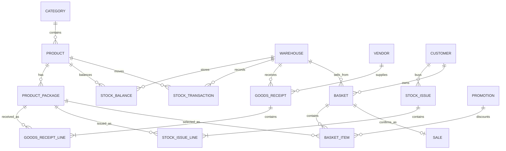

# Store Retail Management Architecture

## System shape

- **Frontend:** React SPA built with Vite, responsive CSS, Axios, React Router.
- **Backend:** Django REST Framework with JWT authentication.
- **Database:** Microsoft SQL Server through Microsoft's `mssql-django` backend and ODBC Driver 18.
- **Database administration:** DBeaver Community.
- **Timezone:** Asia/Bangkok.

## Core design decisions

### 1. Base-unit inventory
Every product has one base unit. Each package converts into that base quantity:

- Unit: 1 base unit
- Pack: configurable, for example 12 base units
- Pallet: configurable, for example 720 base units
- Container: configurable, for example 14,400 base units

Stock balances and safety stock are stored in base units. Purchasing and selling can use any configured package.

### 2. Inventory ledger
`StockTransaction` is the audit ledger. `StockBalance` is the fast current quantity. Every posted stock operation updates both inside a database transaction.

### 3. Draft then post
Goods receipts and stock issues begin as `DRAFT`. Stock only changes when the document is posted. Posted documents cannot be edited through the normal workflow.

### 4. Negative-stock protection
Sales, scrap, transfers, and basket checkout lock the current stock balance and reject a transaction that would make stock negative.

## Main data relationships

## Roles

| Role | Main access |
|---|---|
| Admin | Full system, users, Django Admin |
| Manager | Master data, inventory, promotions, reports |
| Inventory | Products, vendors, warehouses, receipts, issues, stock |
| Cashier | Basket, checkout, customers, stock visibility, sales history |
| Viewer | Read-only operational visibility |

## Important API routes

- `POST /api/auth/token/`
- `GET /api/auth/me/`
- `GET /api/dashboard/summary/`
- `/api/products/`
- `/api/product-packages/`
- `/api/goods-receipts/`
- `POST /api/goods-receipts/{id}/post_receipt/`
- `/api/stock-issues/`
- `POST /api/stock-issues/{id}/post_issue/`
- `/api/baskets/`
- `POST /api/baskets/{id}/add_item/`
- `POST /api/baskets/{id}/checkout/`
- `/api/stock-balances/`
- `/api/stock-transactions/`
- `/api/sales/`
